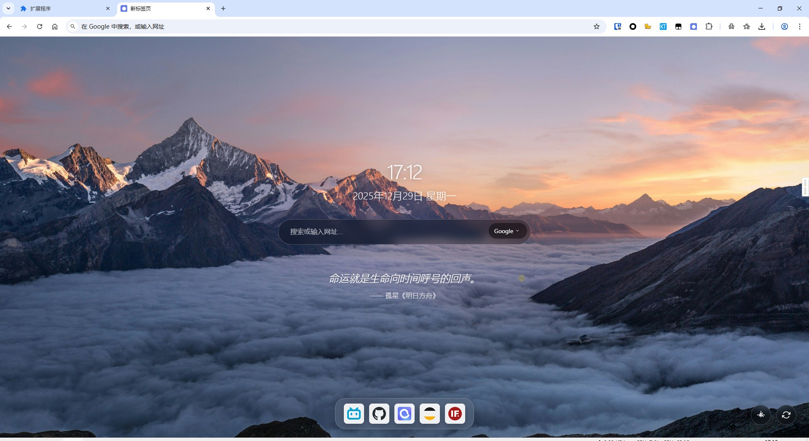
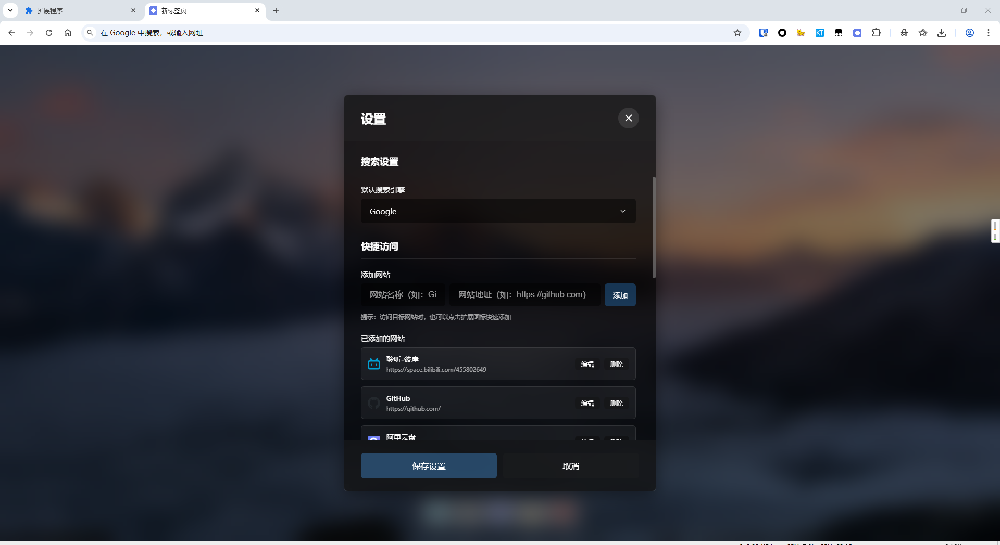

# Snow 

<div align="center">


一个简洁优雅的 Chrome 新标签页扩展，提供自定义背景、每日一言、智能搜索等功能

[功能特性](#-功能特性) • [快速开始](#-快速开始) • [开发指南](#-开发指南) • [贡献指南](#-贡献指南)

</div>

---

## 📖 目录

- [功能特性](#-功能特性)
- [截图展示](#-截图展示)
- [快速开始](#-快速开始)
  - [浏览器兼容性](#浏览器兼容性)
  - [安装步骤](#安装步骤)
  - [使用说明](#使用说明)
- [技术栈](#️-技术栈)
- [开发指南](#-开发指南)
  - [本地开发](#本地开发)
  - [代码规范](#代码规范)
- [贡献指南](#-贡献指南)
  - [提交信息规范](#提交信息规范)
- [问题反馈](#-问题反馈)
- [许可证](#-许可证)
- [致谢](#-致谢)
- [版本信息](#-版本信息)

---

## ✨ 功能特性

- ⏰ **实时时间显示** - 精美的时间和日期展示，支持多种格式
- 🔍 **智能搜索** - 支持百度、Google、Bing 多搜索引擎切换
- 💬 **每日一言** - 随机展示精选句子，支持多种类型（动画、漫画、文学等）
- 🖼️ **自定义背景** - 支持本地上传、URL 图片和默认渐变背景
- 🖱️ **自定义鼠标光标** - 炫酷的鼠标光标跟随效果
- 🎨 **毛玻璃效果** - 现代化的半透明 UI 设计
- ♿ **完整可访问性** - 支持键盘导航和屏幕阅读器（ARIA 标准）
- 📱 **响应式设计** - 完美适配各种屏幕尺寸
- 🔒 **隐私保护** - 所有数据本地存储，不上传任何信息
- ⚡ **轻量高效** - 原生 JavaScript 实现，无框架依赖

---

## 📸 截图展示






---

## 🚀 快速开始

### 浏览器兼容性

- ✅ Chrome 88+
- ✅ Edge 88+
- ✅ 其他基于 Chromium 的浏览器

> 注意：本扩展使用 Manifest V3，需要较新版本的浏览器支持

### 安装步骤

#### 方式一：使用 Release 安装（推荐）

1. **下载安装包**
   - 访问 [Releases 页面](https://github.com/ltba/Snow/releases)
   - 下载最新版本的 `.crx` 文件

2. **安装扩展**
   - 打开 Chrome 浏览器，访问 `chrome://extensions/`
   - 启用右上角的"开发者模式"
   - 将下载的 `.crx` 文件拖入扩展管理页面
   - 确认安装

3. **开始使用**
   - 打开新标签页即可看到扩展界面

#### 方式二：开发者模式安装

1. **下载项目**
   ```bash
   git clone https://github.com/ltba/Snow.git
   cd Snow
   ```

2. **打开扩展管理页面**
   - 在 Chrome 浏览器中访问 `chrome://extensions/`
   - 或通过菜单：更多工具 → 扩展程序

3. **启用开发者模式**
   - 打开页面右上角的"开发者模式"开关

4. **加载扩展**
   - 点击"加载已解压的扩展程序"
   - 选择项目根目录（包含 manifest.json 的目录）

5. **开始��用**
   - 打开新标签页即可看到扩展界面

### 使用说明

- **搜索功能**：在搜索框中输入关键词或网址，按回车键搜索
- **切换搜索引擎**：点击搜索框左侧的引擎图标切换
- **更换背景**：点击右上角设置按钮，选择背景类型（本地上传/URL/默认渐变）
- **刷新一言**：点击句子旁边的刷新按钮获取新的句子
- **自定义设置**：点击设置按钮进行个性化配置（背景、鼠标效果等）
- **键盘快捷键**：
  - `Tab` - 在可交互元素间切换
  - `Enter` - 确认操作
  - `Esc` - 关闭弹窗

---

## 🛠️ 技术栈

### 核心技术

- **JavaScript (ES6+)** - 原生 JavaScript，无框架依赖
- **CSS3** - 模块化 CSS 架构，使用 CSS 变量
- **HTML5** - 语义化标签，支持可访问性

### Chrome APIs

- **Chrome Extensions API** - 扩展核心功能
- **Chrome Storage API** - 本地数据存储
- **Chrome Tabs API** - 标签页管理

### 第三方服务

- **一言 API (Hitokoto)** - 提供每日一言内容

### 开发工具

- Git - 版本控制
- Chrome DevTools - 调试工具

---

## 📖 开发指南

### 本地开发

1. **克隆项目**
   ```bash
   git clone https://github.com/ltba/Snow.git
   cd Snow
   ```

2. **加载扩展**
   - 按照[安装步骤](#安装步骤)加载扩展

3. **开发调试**
   - 修改代码后，在扩展管理页面点击刷新按钮
   - 使用 Chrome DevTools 进行调试
   - 查看控制台输出和网络请求

4. **测试功能**
   - 测试各项功能是否正常
   - 检查不同屏幕尺寸的响应式效果
   - 验证可访问性功能

### 代码规范

#### JavaScript 规范

- 使用 ES6+ 语法
- 采用模块化设计，单一职责原则
- 函数命名使用驼峰命名法
- 添加必要的注释说明

#### CSS 规范

- 使用模块化 CSS 架构
- 使用 CSS 变量管理主题
- 遵循 BEM 命名规范
- 保持样式的可维护性

#### 文件组织

- 按功能模块组织文件
- 保持文件结构清晰
- 避免文件过大，及时拆分

---

## 🤝 贡献指南

欢迎贡献代码！请遵循以下步骤：

1. **Fork 本项目**
   - 点击右上角的 Fork 按钮

2. **创建功能分支**
   ```bash
   git checkout -b feature/AmazingFeature
   ```

3. **提交更改**
   ```bash
   git add .
   git commit -m 'Add: 添加某个功能'
   ```

4. **推送到分支**
   ```bash
   git push origin feature/AmazingFeature
   ```

5. **创建 Pull Request**
   - 在 GitHub 上创建 PR
   - 详细描述你的更改
   - 等待代码审查

### 提交信息规范

使用以下前缀标识提交类型：

- `Add: 添加新功能` - 新增功能
- `Fix: 修复 bug` - 修复问题
- `Update: 更新功能` - 更新现有功能
- `Refactor: 重构代码` - 代码重构
- `Style: 样式调整` - 样式修改
- `Docs: 文档更新` - 文档变更
- `Test: 测试相关` - 测试代码
- `Chore: 构建/工具` - 构建工具或辅助工具变动

**示例**：
```bash
git commit -m "Add: 添加暗黑模式支持"
git commit -m "Fix: 修复搜索框在小屏幕上的显示问题"
git commit -m "Docs: 更新安装说明"
```

---

## 📄 许可证

本项目采用 [GNU General Public License v3.0](LICENSE)

```
Snow - 简洁新标签页 Chrome 扩展
Copyright (C) 2025

This program is free software: you can redistribute it and/or modify
it under the terms of the GNU General Public License as published by
the Free Software Foundation, either version 3 of the License, or
(at your option) any later version.

This program is distributed in the hope that it will be useful,
but WITHOUT ANY WARRANTY; without even the implied warranty of
MERCHANTABILITY or FITNESS FOR A PARTICULAR PURPOSE.  See the
GNU General Public License for more details.

You should have received a copy of the GNU General Public License
along with this program.  If not, see <https://www.gnu.org/licenses/>.
```

---

## 🙏 致谢

感谢以下项目和服务：

- [一言 API (Hitokoto)](https://hitokoto.cn/) - 提供每日一言服务
- [Chrome Extensions Documentation](https://developer.chrome.com/docs/extensions/) - Chrome 扩展官方文档
- [MDN Web Docs](https://developer.mozilla.org/) - Web 技术文档
- 所有贡献者和使用者

---


<div align="center">

**如果这个项目对你有帮助，请给一个 ⭐️ Star！**

Made with ❤️ by 聆听·彼岸

[⬆ 回到顶部](#Snow)

</div>
